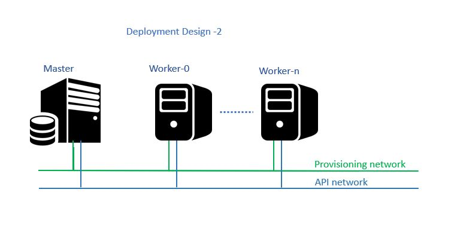

# kubernetes-lab-deployment v1.0
The kubernetes-lab-deployment project will setup ubuntu based kubernetes environment with 1 master and N worker nodes based on Ubuntu operating system

### Recomended basic design
This design is recommended for basic users and first timers to get started with k8s clusters.For multinetwork design , refer to Appendix section.  

  

### 1. Prerequisites:
1. Servers with OS installed , IPs assigned:
   - yes , only this is enough , the package start from very basic configuration like  key exchange with ansible master, setting hostname,hosts file update, etc..
2. Ansible_ssh_user need to have root permission
3. Internet connecton for installing packages

The package will take very minimum inputs IPs,hostname and install k8s with predefined package version in vars file .
**Note** Every dynamic requirement for deployment holds a variable in vars, Inputs can be modified for testing multiple package versions

### 2. Inputs required
#### 2.1. Mandatory inputs
2.1.1.  Fill in the ansible inventory "hosts" file in the package appropriately
  
**NOTE** You can comment **ansible_ssh_pass**  if you have done ssh key exchanges already  
**NOTE** The name you provide for **new_hostname** will be hostname of the nodes. In case of DNS provison hostnames , you can provide received hostname here so it remain same after deployment

      ##Inventory file guide
      [masternode]
      master ansible_host=<<master_node_ip> new_hostname=<master_node_hostname>

      [workernode]
      worker-1 ansible_host=<<worker_node_1_ip>>  new_hostname=<<worker_node_1_hostname>>
      worker-2 ansible_host=<<worker_node_2_IP>> new_hostname=<<worker_node_2_hostname>>
      .
      .
      #fill in all the worker N nodes you need

      [masternode:vars]
      ansible_ssh_user=<<user_name>>
      ansible_ssh_port=22
      ansible_ssh_pass=<<password>>
      
      [workernode:vars]
      ansible_ssh_user=<<user_name>>
      ansible_ssh_port=22
      ansible_ssh_pass=<<password>>

2.1.2 Update Kubernetes API IP in vars/vars.yaml  
  
  Specify the IP of masternode to be used by kubernetes API , this will be more useful if nodes have multipe network interfaces attached and you need to decide which Interface to be exposed for kubernetes APi as per your environmant and firewall settings 

     apiserver_advertise_address : <<master_ip_to_be_used_by_k8s_master_node>>

**Note:** verify if **pod_network_cidr** valus do not overlap with your existing network. update the CIDR if overlapping

####   2.2 Optional Inputs:

You can go through /vars/vars.yaml file and tweak the inputs as per you test environment.  
### 3. Verify connecivity
 Execute below command from ansible host to verify of all nodes are rechable by ansible  
    `ansible all -m ping -i hosts`
  
if this ping gets response from all the nodes donfigured in hosts , proceed to Installation
### 4. Installaton

######    1. Install command:
   
 `ansible-playbook install_k8s_ubuntu.yaml -i hosts --tags=install`
   
######    2. After installation to get token for gui login.
   
` ansible-playbook install_k8s_ubuntu.yaml -i hosts --tags=get_token`
   
######    3. delete k8s cluster and uninstall packages
   
` ansible-playbook install_k8s_ubuntu.yaml -i hosts --tags=uninstall_cluster`
   
 
 ### Appendix
 if you want to have separate network for k8s APIs, you can follow below recommended approach and update variable **apiserver_advertise_address** in vars/vars.yaml file accordingly 

  

